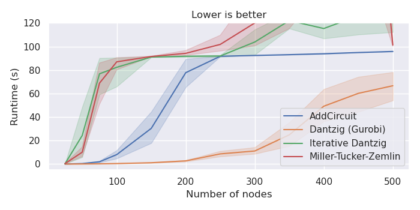

Benchmarking your model
=======================

Benchmarking is an essential step if your model isn't yet meeting the
performance standards of your application or if you're aiming for an academic
publication. This process involves analyzing your model's performance,
especially important if your model has adjustable parameters. Running your model
on a set of predefined instances (a benchmark) allows you to fine-tune these
parameters and compare results. Moreover, if alternative models exist,
benchmarking helps you ascertain whether your model truly outperforms these
competitors.

Designing an effective benchmark is a nuanced task that demands expertise. This
section aims to guide you in creating a reliable benchmark suitable for
publication purposes.

Given the breadth and complexity of benchmarking, our focus will be on the
basics, particularly through the lens of the Traveling Salesman Problem (TSP),
as previously discussed in the ``AddCircuit`` section. We refer to the different
model implementations as 'solvers', and we'll explore four specific types:

- A solver employing the ``AddCircuit`` approach.
- A solver based on the Miller-Tucker-Zemlin formulation.
- A solver utilizing the Dantzig-Fulkerson-Johnson formulation with iterative
  addition of subtour constraints until a connected tour is achieved.
- A Gurobi-based solver applying the Dantzig-Fulkerson-Johnson formulation via
  Lazy Constraints, which are not supported by CP-SAT.

This example highlights common challenges in benchmarking and strategies to
address them. A key obstacle in solving NP-hard problems is the variability in
solver performance across different instances. For instance, a solver might
easily handle a large instance but struggle with a smaller one, and vice versa.
Consequently, it's crucial to ensure that your benchmark encompasses a
representative variety of instances. This diversity is vital for drawing
meaningful conclusions, such as the maximum size of a TSP instance that can be
solved or the most effective solver to use.

For a comprehensive exploration of benchmarking, I highly recommend Catherine C.
McGeoch's book,
`"A Guide to Experimental Algorithmics" <https://www.cambridge.org/core/books/guide-to-experimental-algorithmics/CDB0CB718F6250E0806C909E1D3D1082>`_,
which offers an in-depth discussion on this topic.

Distinguishing Exploratory and Workhorse Studies in Benchmarking
----------------------------------------------------------------

Before diving into comprehensive benchmarking, it’s essential to conduct
preliminary investigations to assess your model’s capabilities and identify any
foundational issues. This phase, known as *exploratory studies*, is crucial for
establishing the basis for more detailed benchmarking, subsequently termed as
*workhorse studies*. These latter studies aim to provide reliable answers to
specific research questions and are often the core of academic publications.
It's important to explicitly differentiate between these two study types and
maintain their distinct purposes: exploratory studies for initial understanding
and flexibility, and workhorse studies for rigorous, reproducible research.

Exploratory Studies: Foundation Building
~~~~~~~~~~~~~~~~~~~~~~~~~~~~~~~~~~~~~~~~

Exploratory studies serve as an introduction to both your model and the problem
it addresses. This phase is about gaining preliminary understanding and
insights.

- **Objective**: The goal here is to gather early insights rather than
  definitive conclusions. This phase is instrumental in identifying realistic
  problem sizes, potential challenges, and narrowing down hyperparameter search
  spaces.

For instance, in the ``AddCircuit``-section, an exploratory study helped us
determine that our focus should be on instances with 100 to 200 nodes. If you
encounter fundamental issues with your model at this stage, it’s advisable to
address these before proceeding to workhorse studies.

    Occasionally, the primary performance bottleneck in your model may not be
    CP-SAT but rather the Python segment where the model is being generated. In
    these instances, identifying the most resource-intensive parts of your Python
    code is crucial. I have found the profiler
    `Scalene <https://github.com/plasma-umass/scalene>`_ to be well-suited to
    investigate and pinpoint these bottlenecks.

Workhorse Studies: Conducting In-depth Evaluations
~~~~~~~~~~~~~~~~~~~~~~~~~~~~~~~~~~~~~~~~~~~~~~~~~~

Workhorse studies follow the exploratory phase, characterized by more structured
and meticulous approaches. This stage is vital for a comprehensive evaluation of
your model and collecting substantive data for analysis.

- **Objective**: These studies are designed to answer specific research
  questions and provide meaningful insights. The approach here is more
  methodical, focusing on clearly defined research questions. The benchmarks
  designed should be well-structured and large enough to yield statistically
  significant results.

Remember, the aim is not to create a flawless benchmark right away but to evolve
it as concrete questions emerge and as your understanding of the model and
problem deepens. These studies, unlike exploratory ones, will be the focus of
your scientific publications, with exploratory studies only referenced for
justifying certain design decisions.

.. hint:: 
   
    `SIGPLAN Empirical Evaluation Checklist <https://raw.githubusercontent.com/SIGPLAN/empirical-evaluation/master/checklist/checklist.pdf>`_
    **if your evaluation has to satisfy academic standards.**

Designing a Robust Benchmark for Effective Studies
--------------------------------------------------

When undertaking both exploratory and workhorse studies, the creation of a
well-designed benchmark is a critical step. This benchmark is the basis upon
which you'll test and evaluate your solvers. For exploratory studies, your
benchmark can start simple and progressively evolve. However, when it comes to
workhorse studies, the design of your benchmark demands meticulous attention to
ensure comprehensiveness and reliability.

While exploratory studies also benefit from a thoughtfully designed benchmark—as
it accelerates insight acquisition—the primary emphasis at this stage is to have
a functioning benchmark in place. This initial benchmark acts as a springboard,
providing a foundation for deeper, more detailed analysis in the subsequent
workhorse studies. The key is to balance the immediacy of starting with a
benchmark against the long-term goal of refining it for more rigorous
evaluations.

Ideally, a robust benchmark would consist of a large set of real-world
instances, closely reflecting the actual performance of your solver. Real-world
instances, however, are often limited in quantity and may not provide enough
data for a statistically significant benchmark. In such cases, it's advisable to
explore existing benchmarks from literature, like the
`TSPLIB <http://comopt.ifi.uni-heidelberg.de/software/TSPLIB95/>`_ for TSP.
Leveraging established benchmarks allows for comparison with prior studies, but
be cautious about their quality, as not all are equally well-constructed. For
example, TSPLIB's limitations in terms of instance size variation and
heterogeneity can hinder result aggregation.

Therefore, creating custom instances might be necessary. When doing so, aim for
enough instances per size category to establish reliable and statistically
significant data points. For instance, generating 10 instances for each size
category (e.g., 25, 50, 75, 100, 150, 200, 250, 300, 350, 400, 450, 500) can
provide a solid basis for analysis. This approach, though modest in scale,
suffices to illustrate the benchmarking process.

Exercise caution with random instance generators, as they may not accurately
represent real-world scenarios. For example, randomly generated TSP instances
might lack collinear points common in real-world situations, like houses aligned
on straight roads, or they might not replicate real-world clustering patterns.
To better mimic reality, incorporate real-world data or use diverse generation
methods to ensure a broader variety of instances. For the TSP, we could for
example also have sampled from the larger TSPLIB instances.

Consider conducting your evaluation using two distinct benchmarks, especially
when dealing with different data types. For instance, you might have one
benchmark derived from real-world data which, although highly relevant, is too
limited in size to provide robust statistical insights. Simultaneously, you
could use a second benchmark based on a larger set of random instances, better
suited for detailed statistical analysis. This dual-benchmark approach allows
you to demonstrate the consistency and reliability of your results, ensuring
they are not merely artifacts of a particular dataset's characteristics. It's a
strategy that adds depth to your evaluation, showcasing the robustness of your
findings across varied data sources. We will use this approach below, generating
robust plots from random instances, but also comparing them to real-world
instances. Mixing the two benchmarks would not be advisable, as the random
instances would dominate the results.

Lastly, always separate the creation of your benchmark from the execution of
experiments. Create and save instances in a separate process to minimize errors.
The goal is to make your evaluation as error-proof as possible, avoiding the
frustration and wasted effort of basing decisions on flawed data. Be
particularly cautious with pseudo-random number generators; while theoretically
deterministic, their use can inadvertently lead to irreproducible results.
Sharing benchmarks is also more straightforward when you can distribute the
instances themselves, rather than the code used to generate them.

Efficiently Managing Your Benchmarks
------------------------------------

Managing benchmark data can become complex, especially with multiple experiments
and research questions. Here are some strategies to keep things organized:

- **Folder Structure**: Maintain a clear folder structure for your experiments,
  with a top-level `evaluations` folder and descriptive subfolders for each
  experiment. For our experiment we have the following structure

::
  
  evaluations
  ├── tsp
  │   ├── 2023-11-18_random_euclidean
  │   │   ├── PRIVATE_DATA
  │   │   │   ├── ... all data for debugging
  │   │   ├── PUBLIC_DATA
  │   │   │   ├── ... selected data to share
  │   │   ├── README.md: Provide a short description of the experiment
  │   │   ├── 00_generate_instances.py
  │   │   ├── 01_run_experiments.py
  │   │   ├── ....
  │   ├── 2023-11-18_tsplib
  │   │   ├── PRIVATE_DATA
  │   │   │   ├── ... all data for debugging
  │   │   ├── PUBLIC_DATA
  │   │   │   ├── ... selected data to share
  │   │   ├── README.md: Provide a short description of the experiment
  │   │   ├── 01_run_experiments.py
  │   │   ├── ....

- **Redundancy and Documentation**: While some redundancy is acceptable,
  comprehensive documentation of each experiment is crucial for future
  reference.
- **Simplified Results**: Keep a streamlined version of your results for easy
  access, especially for plotting and sharing.
- **Data Storage**: Save all your data, even if it seems insignificant at the
  time. This ensures you have a comprehensive dataset for later analysis or
  unexpected inquiries. Because this can become a lot of data, it's advisable to
  have two folders: One with all data and one with a selection of data that you
  want to share.
- **Experiment Flexibility**: Design experiments to be interruptible and
  extendable, allowing for easy resumption or modification. This is especially
  important for exploratory studies, where you may need to make frequent
  adjustments. However, if your workhorse study takes a long time to run, you
  don't want to repeat it from scratch if you want to add a further solver.
- **Utilizing Technology**: Employ tools like slurm for efficient distribution
  of experiments across computing clusters, saving time and resources. The
  faster you have your results, the faster you can act on them.

Due to a lack of tools that exactly fitted my needs I developed
`AlgBench <https://github.com/d-krupke/AlgBench>`_ to manage the results, and
`Slurminade <https://github.com/d-krupke/slurminade>`_ to easily distribute the
experiments on a cluster via a simple decorator. However, there may be better
tools out there, now, especially from the Machine Learning community. Drop me a
quick mail if you have found some tools you are happy with, and I will take a
look myself.

Analyzing the results
---------------------

Let us now come to the actual analysis of the results. We will focus on the
following questions:

- Up to which size can we solve TSP instances with the different solvers?
- Which solver is the fastest?
- How does the performance change if we increase the optimality tolerance?

.. admonition:: **Our Benchmarks:** 

  We executed the four solvers with a time limit of 90s and
  the optimality tolerances [0.1%, 1%, 5%, 10%, 25%] on a random benchmark set
  and a TSPLIB benchmark set. The random benchmark set consists of 10 instances
  for each number of nodes [25, 50, 75, 100, 150, 200, > 250, 300, 350, 400,
  450, 500]. The weights were chosen based on randomly embedding the nodes into
  a 2D plane and using the Euclidean distances. The TSPLIB benchmark consists of
  all euclidean instances with less than 500 nodes. It is critical to have a
  time limit, as otherwise, the benchmarks would take forever. You can find all
  find the whole experiment [here](./evaluations/tsp/).

Let us first look at the results of the random benchmark, as they are easier to
interpret. We will then compare them to the TSPLIB benchmark.

Random Instances
~~~~~~~~~~~~~~~~

A common, yet simplistic method to assess a model's performance involves
plotting its runtime against the size of the instances it processes. However,
this approach can often lead to inaccurate interpretations, particularly because
time-limited cutoffs can disproportionately affect the results. Instead of the
expected exponential curves, you will get skewed sigmoidal curves. Consequently,
such plots might not provide a clear understanding of the instance sizes your
model is capable of handling efficiently.

   The runtimes are sigmoidal instead of exponential because the time limit skews the results. The runtime can frequently exceed the time limit, because of expensive model building, etc. Thus, a pure runtime plot says surprisingly little (or is misleading) and can usually be discarded.

